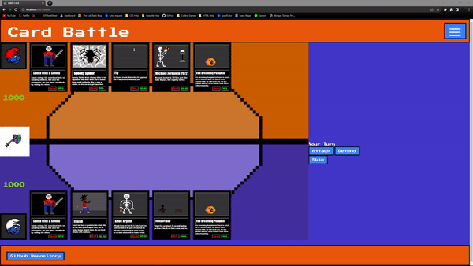

# 🏄‍♂️ James Xalis

**`Digital Craftsman (Developer/Creator)`**

An indie full-stack developer building my version of the digital world one step at a time. Fast learner and eager to explore new technologies. Able to switch between perfectionism and pragmatism. Believer in agile software development, team work and Clean Code. Always questioning the status quo and wanting to improve. Able and willing to think outside the box.

---

### 🧰 Languages and Tools

 

#

### 📺 Latest Projects

#

 
<h3>👨‍💻 James's Coding Journey</h3>

---

